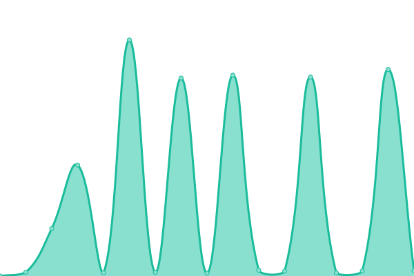
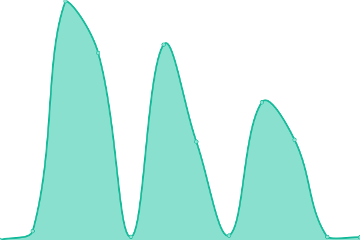

# [📈 Live Status](https://uptime.yunus.eu.org): <!--live status--> **🟧 Partial outage**

This repository contains the open-source uptime monitor and status page for [MD YUNUS](https://yunuscloud.eu.org), powered by [Upptime](https://github.com/upptime/upptime).

With [Upptime](https://upptime.js.org), you can get your own unlimited and free uptime monitor and status page, powered entirely by a GitHub repository. We use [Issues](https://github.com/yunus25jmi1/uptime-yunusteam/issues) as incident reports, [Actions](https://github.com/yunus25jmi1/uptime-yunusteam/actions) as uptime monitors, and [Pages](https://uptime.yunus.eu.org) for the status page.

<!--start: status pages-->
<!-- This summary is generated by Upptime (https://github.com/upptime/upptime) -->
<!-- Do not edit this manually, your changes will be overwritten -->
<!-- prettier-ignore -->
| URL | Status | History | Response Time | Uptime |
| --- | ------ | ------- | ------------- | ------ |
|  [Bitwarden](https://bitwarden.yunus.eu.org) | 🟩 Up | [bitwarden.yml](https://github.com/yunus25jmi1/uptime-yunusteam/commits/HEAD/history/bitwarden.yml) | 

 8277ms
     
 | 

<a href="https://uptime.yunuscloud.eu.org/history/bitwarden">99.37%</a>
    

|  [Book's Website](https://book.yunusplays.eu.org) | 🟩 Up | [book-s-website.yml](https://github.com/yunus25jmi1/uptime-yunusteam/commits/HEAD/history/book-s-website.yml) | 

 502ms
     
 | 

<a href="https://uptime.yunuscloud.eu.org/history/book-s-website">100.00%</a>
    

|  [Excalidraw](https://excalidraw.yunuscloud.eu.org) | 🟩 Up | [excalidraw.yml](https://github.com/yunus25jmi1/uptime-yunusteam/commits/HEAD/history/excalidraw.yml) | 

 4749ms
     
 | 

<a href="https://uptime.yunuscloud.eu.org/history/excalidraw">99.14%</a>
    

|  [Gemini API](https://gemini-search-chatbot.onrender.com) | 🟥 Down | [gemini-api.yml](https://github.com/yunus25jmi1/uptime-yunusteam/commits/HEAD/history/gemini-api.yml) | 

 191ms
     
 | 

<a href="https://uptime.yunuscloud.eu.org/history/gemini-api">0.00%</a>
    

<!--end: status pages-->

[**Visit our status website →**](https://uptime.yunuscloud.eu.org)

## 📄 License

- Powered by: [Upptime](https://github.com/upptime/upptime)
- Code: [MIT](./LICENSE) © [Anand Chowdhary](https://anandchowdhary.com), supported by [Pabio](https://pabio.com)
- Data in the `./history` directory: [Open Database License](https://opendatacommons.org/licenses/odbl/1-0/)
